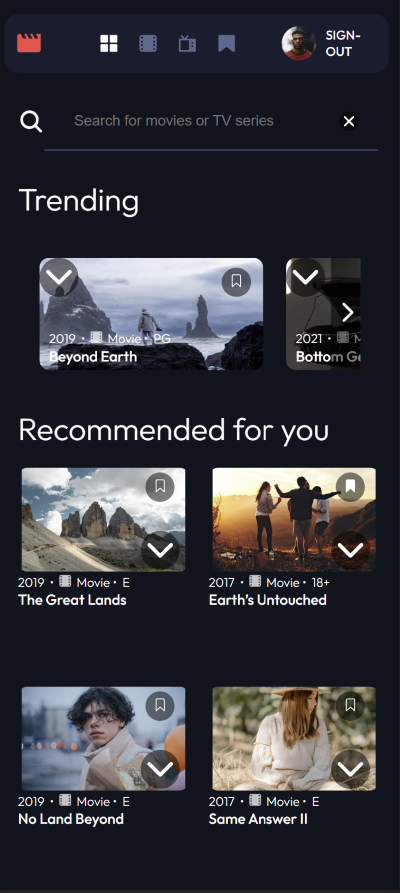

# Frontend Mentor - Entertainment web app solution

This is a solution to the [Entertainment web app challenge on Frontend Mentor](https://www.frontendmentor.io/challenges/entertainment-web-app-J-UhgAW1X). 

## Table of contents

- [Overview](#overview)
  - [The challenge](#the-challenge)
  - [Screenshot](#screenshot)
  - [Links](#links)
- [My process](#my-process)
  - [Built with](#built-with)
  - [What I learned](#what-i-learned)
  - [Continued development](#continued-development)
  - [Useful resources](#useful-resources)
- [Author](#author)
- [Acknowledgments](#acknowledgments)

## Overview

### The challenge

Users should be able to:

- View the optimal layout for the app depending on their device's screen size
- See hover states for all interactive elements on the page
- Navigate between Home, Movies, TV Series, and Bookmarked Shows pages
- Add/Remove bookmarks from all movies and TV series
- Search for relevant shows on all pages
- **Bonus**: Build this project as a full-stack application
- **Bonus**: If you're building a full-stack app, we provide authentication screen (sign-up/login) designs if you'd like to create an auth flow

### Screenshot

### Links

- Solution URL: [Github-rep](https://github.com/PeshwariNaan/flix-app.git)
- Live Site URL: [Live-Link](https://your-live-site-url.com)

## My process

### Built with

- React
- [React Router 6](https://github.com/remix-run/react-router/blob/main/docs/getting-started/tutorial.md)
- Firebase / Firestore v9
- React Portals
- Vite
- CSS Grid
- Flexbox
- Mobile-first workflow
- [React](https://reactjs.org/) - JS library- 
- [Styled Components](https://styled-components.com/) - For styles

### What I learned

There was a lot to digest with this particular project with learning and Firebase / Firestore. I have used Firebase before in classes I have taken, but the way I implemented this project felt more complicated with how I was creating and querying the collections. I felt the documentation was not very easy to understand and in the end I felt like it took too much time. Creating user documents for authentication went well but I did have problems trying to figure out how to store bookmarks for individual users. As things stand now, I can add user bookmarks to an array in a document and delete them in Firestore. I have not yet implemented retrieving the bookmarks on the initial load. The basic bookmarks function works fine now but the data will not persist. 

In summary, I learned a lot about firebase / firestore and can fully implement authentication and different types of log-in/sign-in methods such as sign-in with google or any other third party authentication. I understand how the creation of collections and documents (especially nested) are created and fetched.

I have used react portals once before but this was great project to use them with the show details modal. This was great practice to solidify my understanding of portals and how useful they can be.

Last but not least - I was able to code my own image slider. I feel I spent way too much time on this particular aspect of the project but I refused to give up. I know there are a lot of packages out there that I can use but I wanted to fully understand how to code my own. It's not very fancy but I learned a lot about how to use refs with the UseRef hook and play around with creating my own hooks. This was also great in really understanding css positioning in depth.

### Continued development

I had areas in my project where I repeated code on each page that I needed the search-bar. I know there are more efficient ways to code this and I will refactor the code in the future. I have also been learning typescript and I would like to migrate this project over to that. 

I have also been trying to focus on my productivity with my projects. I still feel like I am not moving as quickly as I could be. I have been keeping a work journal which has helped me keep focused and aided me in realizing my ideas and approaches to whatever problems I am trying to solve. I take a few minutes everyday when I finish working to write down a few thoughts and improvements I can make and then read them the next day when I start.

I would also like to create a new image slider that works with an index so I can create an infinite loop like what you would find on netflix.

### Useful resources

- [Firestore-data-reference](https://cloud.google.com/firestore/docs/samples/firestore-data-reference-subcollection) - This helped me with understanding the syntax to query/create collections and documents and will definitely use it going forward with any firebase projects.

## Author

- Github - [J.D. Browne](https://www.your-site.com)
- Frontend Mentor - [@PeshwariNaan](https://www.frontendmentor.io/profile/PeshwariNaan)

## Acknowledgments

As always, I would like to tip my hat to the good people at Frontend Mentor and to all the students out there relentlessly coding their nights away.

